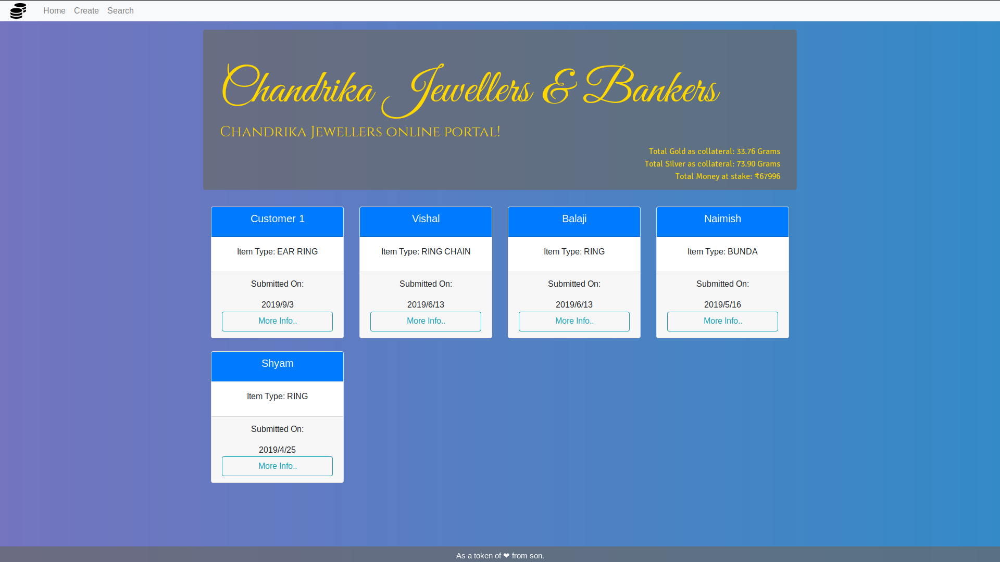
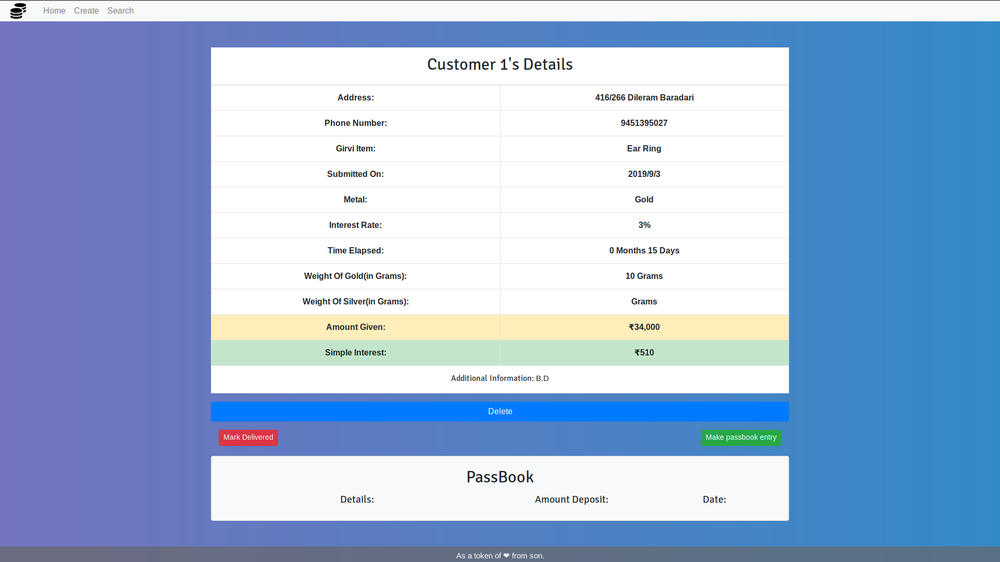

# Loan Application
Esto es un aplicación full stack que apunta a digitalizar los servicios de prestamos usados por numerosos joyeros y banqueros.
Contiene los datos de todos los clientes, y mantiene una libreta para cada garantia dentro de la tienda.
Calcula automaticamente los intereses a pagar por el cliente en base al numero de dias transucrridos y al porcentaje de interes aplicable.
También mantiene varias estadisticas en beneficio del propietario.





## Instalación

1.Duplica/Descarga este repositorio.

2.Necesitas tener Node.js y NPM instalado, por tanto, ejecuta el siguiente comando:

```sudo apt-get install nodejs```

aquello deberia instalar Nodejs y npm.

3.Esta aplicación hace uso de Mongodb para manejo de base de datos, por tanto instalalo usando el siguiente comando:

```sudo apt-get install mongodb```

4.Ve a la carpeta del proyecto y ejecuta el comando `npm install` para instalar todas las dependencias indicadas en el package.json

## Usando la Aplicación

1.Mongodb necesita el servicio mongod andando, por tanto en el terminal, ejecuta el siguiente comando:

``` sudo mongod ```

2.Ve a la carpeta del proyecto y ejecuta la aplicación usando el siguiente comando:

``` node app.js ```

3.El servidor local se iniciará en el puerto 3000, por tanto abre el navegador y ve a la siguiente URL:

>http://localhost:3000/


